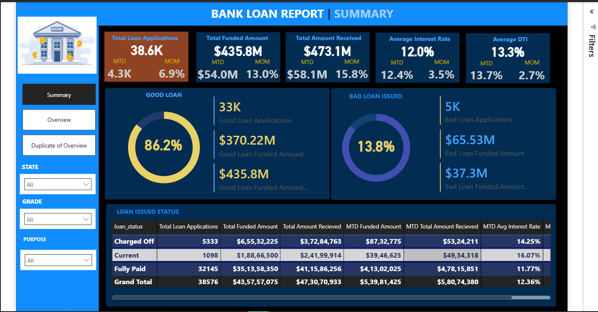
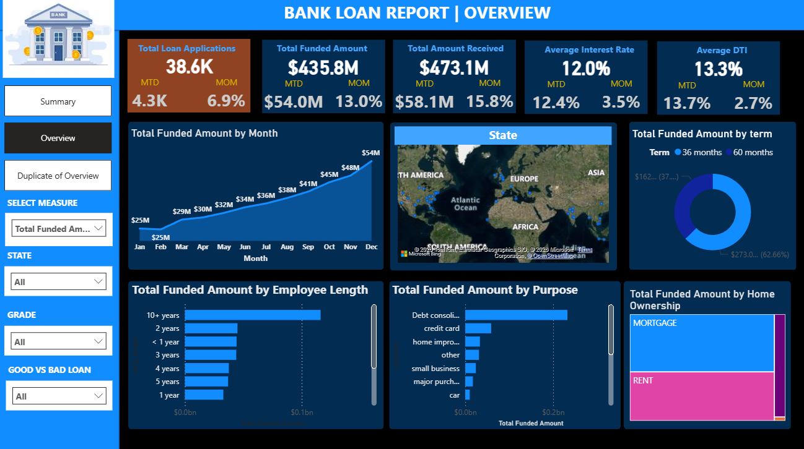
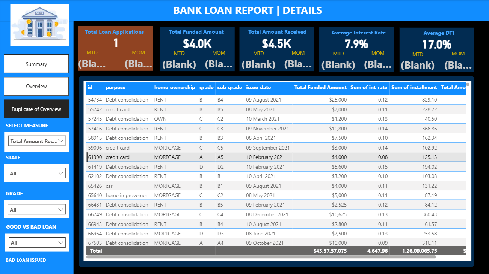

# 🏦 Bank Loan Analysis Dashboard | Power BI Project



---

# 📊 Project Overview

The **Bank Loan Analysis Dashboard** is a comprehensive Business Intelligence solution built using **Power BI, SQL Server, and DAX** to analyze loan portfolio performance, monitor risk, and provide actionable insights into lending operations.

This project enables financial institutions to track loan performance, identify risk patterns, and optimize decision-making through interactive dashboards and real-time KPI monitoring.

---

# 🎯 Business Objectives

This dashboard helps solve key business problems:

- Monitor overall loan portfolio health
- Identify good and bad loans
- Track loan funding and repayment performance
- Analyze borrower financial and employment characteristics
- Support data-driven lending decisions

---

# 📌 Dashboard Structure

The dashboard consists of 3 main analytical pages:

---

# 1️⃣ Summary Dashboard

Provides high-level portfolio performance overview.

## Key Metrics

- Total Loan Applications: **38.6K**
- Total Funded Amount: **$435.8M**
- Total Amount Received: **$473.1M**
- Average Interest Rate: **12.0%**
- Average DTI: **13.3%**

## Risk Distribution

Good Loans:
- 33K Applications
- $370.22M Funded
- 86.2% of total loans

Bad Loans:
- 5K Applications
- $65.53M Funded
- 13.8% of total loans

## Loan Status Breakdown

- Fully Paid
- Current
- Charged Off

Provides clear view of loan performance and risk exposure.

---

# 2️⃣ Overview Dashboard

Provides detailed analytical insights across multiple dimensions.

## Monthly Trend Analysis

- Tracks loan funding trends month-by-month
- Helps identify growth patterns

## Geographic Analysis

- Loan distribution by State
- Identifies high-performing regions

## Loan Segmentation

Analysis by:

- Loan Term (36 vs 60 months)
- Employment Length
- Loan Purpose
- Home Ownership

Helps understand borrower behavior and portfolio composition.

---

# 3️⃣ Details Dashboard

Provides granular loan-level operational insights.

Includes:

- Loan ID
- Loan Purpose
- Home Ownership
- Loan Grade
- Issue Date
- Funded Amount
- Interest Rate
- Installment Amount

Enables deep-level operational and risk analysis.

---

# 🛠 Technical Implementation

## Tools Used

- Power BI
- SQL Server
- DAX (Data Analysis Expressions)
- Power Query
- CSV Dataset

---

## Key DAX Measures

### Total Loan Applications


```DAX
Total Loan Applications = COUNT(bank_loan_data[id])
--------------------------------------------------
Good Loan Applications
--------------------------------------------------
Good Loan Applications =
CALCULATE(
    [Total Loan Applications],
    bank_loan_data[Good v Bad Loan] = "Good Loan"
)
-------------------------------------------------
Good Loan Percentage
Good Loan % =
DIVIDE(
    [Good Loan Applications],
    [Total Loan Applications]
)
